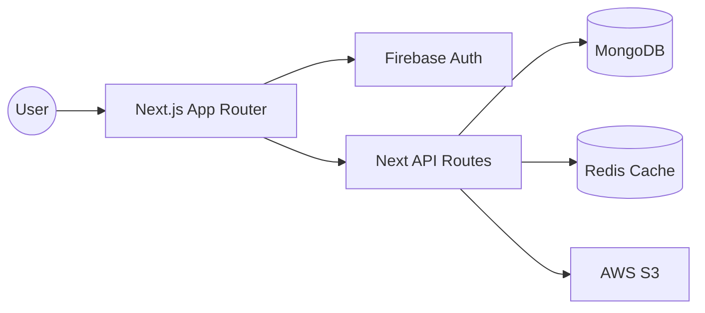

# EduShare: The Peer-to-Peer Knowledge Ecosystem
### *Redefining Collaborative Learning through the Knowledge-to-Credit Economy*

---

## 📋 Abstract
EduShare is a production-grade, decentralized learning platform designed to empower students through peer-to-peer knowledge exchange. By shifting the educational paradigm from passive consumption to active contribution, EduShare creates a self-sustaining ecosystem where students are both creators and learners. Built with **Next.js 14**, **Firebase**, and **MongoDB**, the platform integrates a unique **Knowledge-to-Credit Economy** that incentivizes high-quality educational content and collaborative engagement.

---

## 📑 Table of Contents
1. [Project Overview](#1-project-overview)
2. [Problem Statement](#2-problem-statement)
3. [Proposed Solution](#3-proposed-solution)
4. [The Knowledge-to-Credit Economy (USP)](#4-the-knowledge-to-credit-economy-usp)
5. [Core Features Implemented](#5-core-features-implemented)
6. [Technical Stack](#6-technical-stack)
7. [System Architecture](#7-system-architecture)
8. [Accessibility & Responsiveness](#8-accessibility--responsiveness)
9. [Security & Production Hardening](#9-security--production-hardening)
10. [Performance Optimization](#10-performance-optimization)
11. [UI/UX Philosophy](#11-uiux-philosophy)
12. [Feature Evolution Timeline](#12-feature-evolution-timeline)
13. [Future Roadmap](#13-future-roadmap)
14. [Production Readiness](#14-production-readiness)
15. [Challenges Faced](#15-challenges-faced)
16. [Learning Outcomes](#16-learning-outcomes)
17. [Conclusion](#17-conclusion)

---

## 1. Project Overview
EduShare is more than a content-sharing site; it is a **collaborative student-driven learning ecosystem**. 

### Vision
To democratize education by transforming every student into a potential educator, breaking down the traditional hierarchies of knowledge distribution.

### Mission
To provide a secure, accessible, and rewarding platform where academic resources are accessible to all, powered by the collective intelligence of the student community.

### Core Philosophy
- **Peer-First**: Knowledge is most effectively transferred when shared between peers who understand each other's challenges.
- **Contribution-Driven**: The platform lives and dies by the quality of community contributions.
- **Access over Profit**: Financial barriers should never stop a student from learning.

---

## 2. Problem Statement
Traditional digital learning platforms suffer from several systemic flaws:
- **Financial Barriers**: High subscription costs exclude students from lower-income backgrounds.
- **Teacher-Centricity**: Content is often top-down, lacking the relatability and specific context that peer-created notes and videos provide.
- **Passive Consumption**: Most platforms reward viewing rather than doing or teaching, leading to lower retention rates.
- **Passive Content Focus**: Lack of interactive validation (quizzes/certificates) for community-generated content.
- **Lack of Recognition**: Students who spend hours creating study guides for their peers have no formal way to earn "capital" or recognition for their effort.

---

## 3. Proposed Solution
EduShare introduces a **Peer-to-Peer (P2P) Learning Model** that decentralizes education:
- **Decentralized Knowledge**: No central authority dictates what is learned; the community determines value through engagement and credits.
- **Student Empowerment**: Tools for professional video hosting, document sharing, and quiz creation are placed directly in the hands of students.
- **Collaborative Ecosystem**: Integrated bookmarks, comments, and following systems create a social graph focused purely on academic growth.

---

## 4. Unique Selling Point (USP)
### The "Knowledge-to-Credit Economy"
The heart of EduShare is its innovative **Atomic Credit Layer**. Unlike traditional platforms where access is gated by currency, EduShare gates access by **contribution**.

| Action | Economic Impact |
|---|---|
| **Upload High-Quality Video** | Earn Credits (Based on views/engagement) |
| **Share Verified Notes** | Earn Credits (Per download) |
| **Pass a Peer-Created Quiz** | Earn Credits (Incentivizing mastery) |
| **Consume Premium Content** | Spend Credits (Recirculating value) |

**Impact**: This model transforms passive learners into active contributors. To "buy" knowledge, you must first "create" knowledge, ensuring a constant influx of fresh, relevant content.

---

## 5. Core Features Implemented
EduShare boasts a comprehensive suite of SaaS-grade features:

- **🔐 Multi-Provider Auth**: Secure identity management via Firebase (Email/Google) synced with MongoDB profiles.
- **📱 Responsive Command Center**: A unified dashboard for tracking credits, activity, and learning progress.
- **🎥 Video Lifecycle**: Support for large-scale video uploads directly to S3 with Subject/Topic tagging.
- **📄 Resource Vault**: Sophisticated study note distribution with extension-specific icons and metadata.
- **📝 Validation Engine**: Interactive quiz system allowing creators to test learners and reward them with certificates.
- **🏆 Global Leaderboard**: High-performance ranking system to recognize top contributors.
- **🛡️ Administrative Suite**: Real-time moderation queues, user management, and platform analytics.
- **⚖️ Legal Infrastructure**: Production-ready Privacy Policy, Terms of Service, and DMCA management.
- **♿ Accessibility Architecture**: Full keyboard navigation, ARIA support, and WCAG 2.1 AA compliant contrast ratios.

---

## 6. Technical Stack
| Layer | Technology | Rationale |
|---|---|---|
| **Frontend** | Next.js 14 (App Router) | SEO, Server Components, and optimized routing. |
| **Logic** | React 18 & Framer Motion | State-driven UI with fluid, meaningful animations. |
| **Styling** | Tailwind CSS & CSS Variables | Scalable design system with centralized theme tokens. |
| **Database** | MongoDB Atlas | Flexible schema for evolving educational resource metadata. |
| **Cache/Rate Limit** | Upstash Redis | Fast, serverless state management for API protection. |
| **File Storage** | AWS S3 (Presigned URLs) | Scalable, secure uploads without overloading server threads. |
| **Identity** | Firebase Admin SDK | Enterprise-grade security and session management. |

---

## 7. System Architecture
EduShare utilizes a decoupled, serverless-ready architecture.

### High-Level Flow

### Key Architectures:
1. **Presigned Upload Flow**: Client requests a secure S3 URL → Server validates via RBAC → Client uploads directly to S3. This eliminates server bandwidth bottlenecks.
2. **Atomic Credit System**: Transactions use MongoDB sessions to ensure that credit transfers between users are atomic and consistent, even under high load.
3. **Middleware Layer**: A custom `apiHandler` manages identity synchronization, role elevation, and error logging across all endpoints.

---

## 8. Accessibility & Responsiveness
EduShare was built with an **Accessibility-First** philosophy:
- **WCAG Compliance**: High-contrast color palettes and semantic HTML5 elements ensure screen-reader compatibility.
- **Keyboard Navigation**: Comprehensive focus-trap management and visible focus indicators for all interactive elements.
- **Mobile-First Design**: A fluid layout system that transitions from a complex desktop dashboard to a streamlined mobile "App-like" experience using Tailwind's responsive prefixes.

---

## 9. Security & Production Hardening
- **Role-Based Access Control (RBAC)**: Granular permissions for Users, Moderators, and Admins.
- **Global Rate Limiting**: Redis-backed sliding-window limiters protect sensitive endpoints (Uploads, Auth, Credits).
- **Zod Validation**: Strict schema enforcement for all incoming API request bodies.
- **Moderation Pipeline**: Built-in reporting system allowing users to flag content, which is then handled in the Admin Terminal.
- **Sentry Integration**: Real-time error tracking and performance monitoring in production.

---

## 10. Performance Optimization
- **Zero-Layout Shift (CLS)**: Skeleton loaders and fixed-aspect-ratio containers ensure a stable visual experience during data fetching.
- **Intelligent Caching**: Dual-layer strategy using in-memory caches for high-frequency dashboard reads and Redis for global state.
- **Asset Optimization**: Automatic image optimization via Next.js and CloudFront-ready asset delivery.

---

## 11. UI/UX Philosophy
The design system, **"Grounded Professional"**, prioritizes utility over flash:
- **Minimalist Aesthetics**: Clean lines, 2xl border radii, and subtle glassmorphism.
- **Information Density**: Cards (VideoCard/NoteCard) are optimized to show critical metadata (credits, extension, author) without overwhelming the user.
- **Interaction Feedback**: Meaningful hover states and framer-motion transitions provide tactile feedback.

---

## 12. Feature Evolution Timeline
1. **Phase 1 (MVP)**: Core authentication and basic S3 file sharing.
2. **Phase 2 (Economy)**: Implementation of the Atomic Credit system and Transaction Ledger.
3. **Phase 3 (Interactivity)**: Addition of Quizzes, Certificates, and real-time Comments.
4. **Phase 4 (Hardening)**: Security audit, RBAC implementation, and global rate limiting.
5. **Phase 5 (Refinement)**: Design system normalization (Visual Audit) and accessibility sweep.

---

## 13. Future Roadmap
- **🤖 AI Study Assistant**: RAG-based AI that answers questions using the specific context of uploaded notes.
- **🎧 Adaptive Recommendations**: Machine learning model to suggest content based on user's credit-spending history.
- **🌐 Collaborative Study Rooms**: Real-time WebRTC-powered virtual rooms for group study.
- **📊 Advanced Analytics**: Detailed engagement heatmaps for content creators.
- **📱 Native Mobile App**: Leveraging the existing API layer for an iOS/Android experience.

---

## 14. Production Readiness
EduShare is currently at **v1.0-RC (Release Candidate)** status:
- **Deploy Target**: Vercel (Edge-optimized).
- **Testing**: Playwright E2E suites cover critical paths (Login -> Upload -> Pass Quiz -> Earn Credits).
- **Monitoring**: Sentry and Pino logging are active and configured.
- **Database Scalability**: MongoDB Atlas configuration with horizontal scaling enabled.

---

## 15. Challenges Faced
- **MongoDB SRV in Serverless**: Managed connection pooling and registration issues during high-frequency cold starts.
- **Large File Handling**: Perfecting the Presigned URL handshake to ensure reliable multi-gigabyte video uploads.
- **Design Consistency**: Standardizing the visual language across dozens of complex pages while maintaining high performance.

---

## 16. Learning Outcomes
This project demonstrated:
- Expertise in the **MERN** stack with **Next.js 14**.
- Implementation of **Economic Systems** within software architecture.
- Deep understanding of **Cloud Infrastructure** (AWS, Redis, Sentry).
- Mastery of **Modern CSS** and **Design Systems**.
- Commitment to **Accessibility** as a first-class citizen in software development.

---

## 17. Conclusion
EduShare represents the future of democratic education. By rewarding contribution and fostering a peer-to-peer exchange, the platform solves the passivity and financial barriers inherent in modern EdTech. It is a technically robust, professionally designed, and socially impactful ecosystem ready to empower the next generation of student-creators.

---
**Maintained by the EduShare Engineering Team**
*Generated: May 2026*
