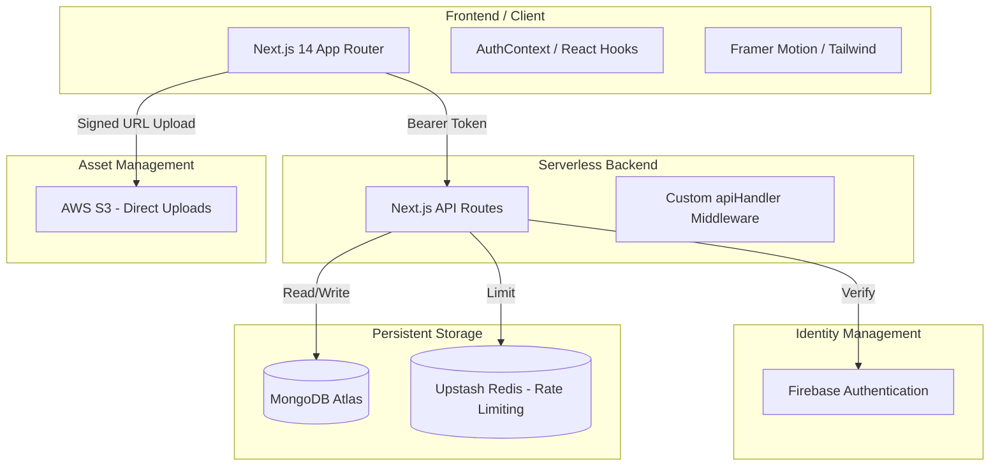
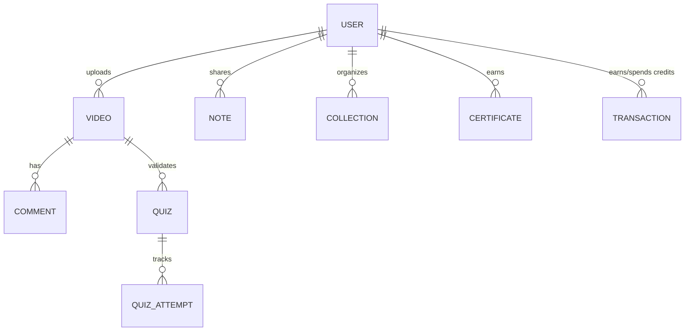

# EduShare Platform: Senior Developer's Project Overview 🎓🚀

Welcome to the EduShare codebase. This document is a high-level technical guide designed for developers who want to understand the architecture, data flow, and engineering principles behind this Peer-to-Peer Learning Platform.

---

## 1. System Architecture Overview

EduShare is built on a modern, decoupled architecture designed for scale, security, and developer productivity.

---

## 2. The Core Tech Stack

### Frontend: Next.js 14 (App Router)
- **Why**: We utilize React Server Components (RSC) for performance and the standard App Router for intuitive directory-based routing.
- **Styling**: Vanilla CSS + Tailwind CSS. We follow a "Grounded Professional" design system, moving away from sci-fi metaphors to ensure accessibility.
- **Animations**: `framer-motion` for smooth, micro-interaction driven UX.

### Backend: Next.js API Routes + Mongoose
- **Database**: MongoDB Atlas. We use Mongoose for schema enforcement and modeling.
- **Middleware**: A custom `apiHandler.js` wraps all routes to provide:
  - Identity verification via Firebase Admin SDK.
  - Role-Based Access Control (RBAC).
  - Global error logging with Sentry.
  - Automatic database connection management.

### Identity: Firebase Auth
- **Why**: Handles secure password management, Google OAuth, and session tokens without the overhead of maintaining a custom auth backend.
- **Sync**: User records are secondary-indexed in MongoDB for relational features (credits, following, bookmarks).

### Storage: AWS S3
- **Operation**: We use **Pre-signed URLs**. The client requests a URL from the API, then uploads directly to S3. This keeps our Next.js server threads light and scalable.

---

## 3. Data Relationships (Logical Mapping)

### Key Logic Flows:
1.  **Credit Economy**: Users earn credits by sharing resources and participating in the community. These are tracked via `Transaction` and updated atomically on the `User` document.
2.  **Certification**: When a user watches a video and passes the associated `Quiz`, a `Certificate` is hashed and generated, linking the user to the specific learning outcome.
3.  **Peer Interaction**: Follows, likes, and comments trigger `Notifications`, ensuring a highly engaged community loop.

---

## 4. Senior Developer Best Practices in this Repo

### Security 🛡️
- **Rate Limiting**: Implemented via `@/lib/rateLimit` using Upstash Redis to prevent API abuse and brute-force attacks.
- **Model Registration**: To avoid `MissingSchemaError` in serverless environments, we explicitly import referenced models (e.g., `Video`, `User`) before calling `.populate()`.

### Performance ⚡
- **Glassmorphism**: We use `backdrop-blur` and optimized transparency to create a premium feel without heavy image assets.
- **Cache Management**: We use a dual-layer caching strategy:
  - In-memory `memCache` for extremely frequent dashboard reads.
  - Redis cache for cross-instance state synchronization.

### Clean Code 🧹
- **Terminology**: We strictly adhere to professional educational nomenclature. Avoid "fancy/sci-fi" words in the UI to ensure the platform feels grounded.
- **Standardized Responses**: Use the `apiHandler` to return consistent JSON shapes across all endpoints.

---

## 5. Getting Started for New Developers

1.  **Env Setup**: Copy `.env.local.example` to `.env.local` and fill in the Firebase/AWS/Mongo keys.
2.  **Run Build**: Always run `npm run build` locally before pushing to catch Mongoose registration or linting errors.
3.  **Deployment**: Target **Vercel** for the most seamless integration with the Next.js infrastructure.

---
**Maintained by the Senior Engineering Team**
*Last Updated: April 2026*
